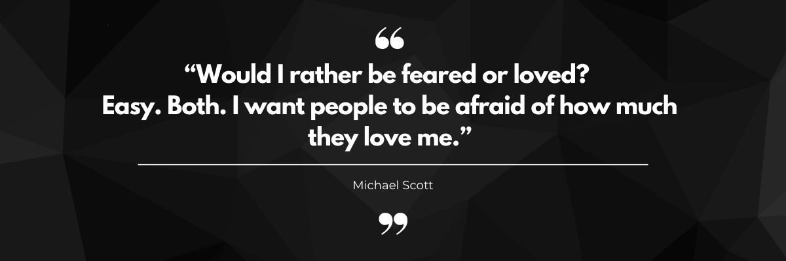

  
  

  

  
 
  
### Glad to see you here!
I am a former U.S. Marine Veteran who has transitioned into a Full Stack Web Development Instructor with extensive coding experience dating back to the early days of Myspace. I hold a degree in Graphic Communication (Front-End Dev) from California State University, Los Angeles, and have further honed my skills by attending Codeup Bootcamp.

During my time at Cal State LA, I was selected to be part of the Adobe Student Advisory team where I had the opportunity to demonstrate the importance of UX/UI and Front-End Developers to my fellow marketers and future developers. Additionally, I was fortunate enough to volunteer with Google and teach high school students in East Los Angeles how to build websites using HTML, CSS, and Javascript.

My area of expertise lies in building full-stack dynamic websites that enable users to perform CRUD (Create, Read, Update, and Delete) operations. I take pride in designing front-end interfaces that are visually stunning and aligned with the application's goals, whether it's using Pure CSS or Bootstrap.

Currently, I am a Full-Stack Associate Web Development Instructor at Codeup in Texas, where I work with a wide range of languages including HTML/CSS, Javascript, MySQL, Java, and Spring Boot.

   

- 🔭 I’m currently working at [Codeup](https://github.com/rishavanand/github-profilinator) as a Full-stack Associate Web Dev Instructor  
- 🌱 I’m currently learning Spring and Spring Boot  
- ❓ Ask me about anything related to Front-End development, Java, Spring and Spring Boot  
- ⚡ Fun fact: When I was in High school, I had the opportunity to win a state championship 🏆 in Basketball 🏀 

 

 

  

   

___

## Languages and Tools  

  
  
  
  
  
  
  
  
  
  
  
  
  
  
  
  
  
  
  
  
  
  
  
  
  

  

   

___

## Github Stats  
<table align='center'><tr style="border: none"><td valign="top" width="30%" style="border: none">

</td><td valign="top" width="30%" style="border: none">

</td></tr></table>  

